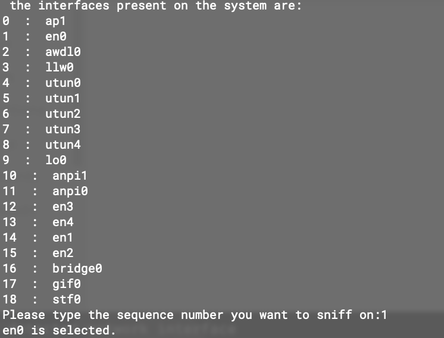

# Description
This repo is created for   Comp Net & Distrib Sys course work, College of Software Engineering, Sichuan University and inspired by the [httpdump repo](https://github.com/hsiafan/httpdump) developed by Golang. Thanks to somewho make contribution for the open source community.<br></br>
Based on libpcap and Wireshark we used, we can easily utilize the current pcap libaray to implement a brand new command-line toolkit for the simple packet capture.
# Installation
* Prerequisite: [libpcap](https://www.tcpdump.org/)
    ```
    make all

    make clean
    ```

    The tool's Makefile config can be customized by your own requests.
# Feature
* Parse pcap file
* Select specified network interface to capture the packet
* Analysis the received packet
# Example
 Just like what you ever did by Wireshark which is known as a GUI-based packet-capture tool, httpdump has similar grammatical instructions to filter those packets.
* Open without filter conditions

    ```httpdump```

* Open with filter conditions

    ```
    httpdump src host 192.168.1.177

    //Capture packets from host ip 192.168.1.177

    httpdump dst port 80

    //Capture tcp/udp of which destination port is 80

    httpdump not tcp

    //Do not capture packets of which protocol is tcp
    ```
* Select detected network interface
    You are expected to select an appropriate network interface to begin
    
